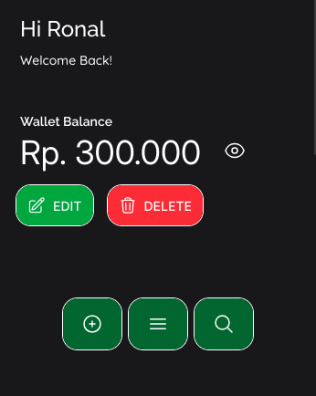
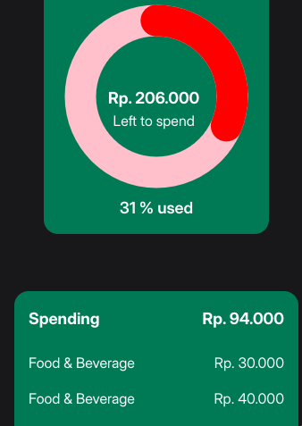
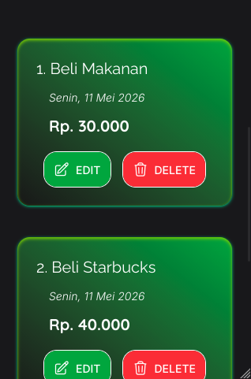

# MoneyMate

MoneyMate is a personal finance tracker web app built with Vanilla JavaScript and modular architecture.

This project is currently under active development and will continue to evolve with new features, UI improvements, and better state management approaches over time.

## 🌐 Live Demo
Check out the live website: https://moneymate-tracker.netlify.app/

## 🚧 Project Status

> Work in Progress (WIP)

The current version is not final yet.  
Some features, UI sections, and architecture decisions may still change in future updates.

---

## ✨ Features

- Add and delete transactions
- Balance calculation
- Income & expense tracking
- Local storage persistence
- Modular JavaScript structure
- Responsive UI
- Custom Tailwind utility classes

---

## 🛠️ Tech Stack

- HTML
- Tailwind CSS
- Vanilla JavaScript (ES Modules)
- LocalStorage API

---

## 📂 Project Structure

```
src/
│
├── data/
├── storage/
├── controller/
├── ui/
└── main.js
```

The project follows a modular architecture approach to separate:
- state management
- storage logic
- UI rendering
- business logic

---

## 📸 Preview

### Dashboard UI




UI previews below represent the current mobile-first version of the application.

---

## 🎯 Future Plans

- Optimizing search transactions
- Light mode
- Better desktop responsiveness

---

## 🧠 Learning Goals

This project was created to improve understanding of:
- modular JavaScript architecture
- DOM rendering flow
- state management
- local storage synchronization
- scalable frontend structure

---

## ⚠️ Disclaimer

This project is still in development and may contain unfinished features or experimental implementations.
